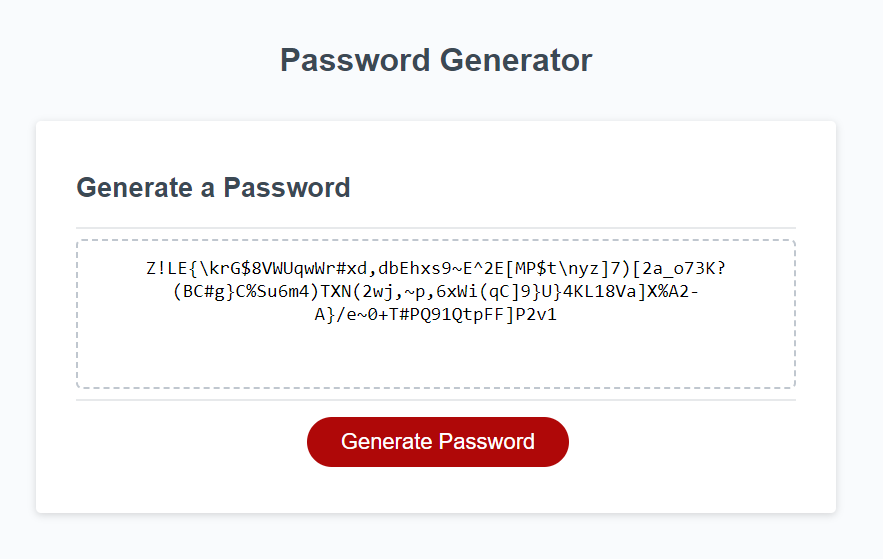

# Module 5 Challenge

## Description

This application is designed to empower employees by providing a user-friendly interface to generate secure and random passwords based on their specified criteria. By modifying the provided starter code, you can create a browser-based app with dynamically updated HTML and CSS, powered by JavaScript.

## Table of Contents

  - [Description](#description)
  - [Installation](#installation)
  - [Usage](#usage)
  - [Features](#features)
  - [Screenshots](#screenshots)
  - [Credits](#credits)
  - [Technologies Used](#technologies-used)

## Installation

To run this project locally, follow these steps:

1. Clone the repository to your local machine. In bash type:

&nbsp;&nbsp;&nbsp;&nbsp;&nbsp;&nbsp;`git clone https://github.com/MrKatrish/password_generator`

2. Open the index.html file in your preferred web browser.

3. Explore the different functionalities of the password generator.

## Usage

1. Open the app in your web browser.

2. Specify the desired password criteria by selecting options such as length and character types.

3. Click the "Generate Password" button to generate a random password based on the specified criteria.

4. The generated password will be displayed on the screen.

## Features

Dynamic Password Generation: The app allows users to select criteria for their passwords, such as length and character types (uppercase letters, lowercase letters, numbers, and special characters).

Responsive Design: The user interface is crafted to be clean, polished, and responsive, ensuring a seamless experience across various screen sizes and devices.

## Screenshots

https://mrkatrish.github.io/password_generator/

## Credits

Thanks for help to my collagues for explaining and directing me to the right path. Many thanks to edX instructor and TAs for taking great care of me.

## Technologies Used

- HTML5
- CSS3
- Javascript